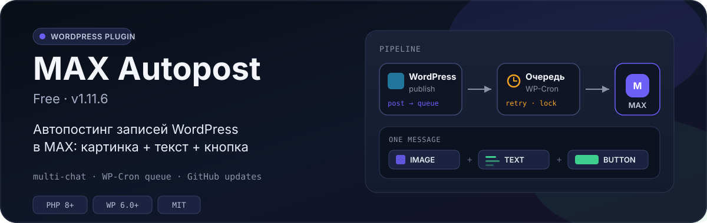
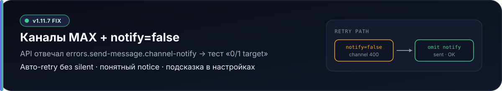
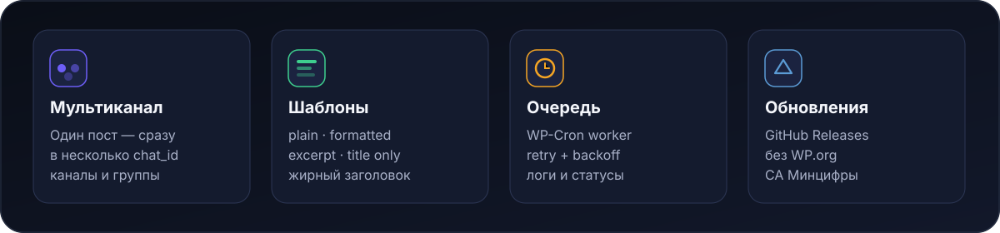
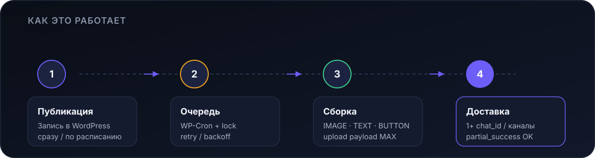

<p align="center">
  
</p>

<p align="center">
  <a href="https://github.com/A-Krivoshen/max-autopost/releases/latest"></a>
  
  
  
</p>

**MAX Autopost (Free)** — WordPress-плагин для автоматической отправки постов в [MAX](https://max.ru): одно сообщение с картинкой, текстом и кнопкой, очередь на WP-Cron и поддержка нескольких каналов.

---

## Что нового в 1.12.0

| | |
| --- | --- |
| **Обновление** | Автоворкер, stamp и cutoff не сбрасываются. В ошибку уходят только queued старше 14 дней. |
| **Один пост** | `wp max-autopost send <id>` и `KRV_MAX_Autopost::send_post_now($id)` шлют именно эту запись, а не голову очереди. |
| **Пачка** | За тик уходит до N постов с паузой. HTTP 429 останавливает пачку и не растит счётчик попыток. |
| **Переочередь** | Сначала сухой просмотр и отдельное подтверждение. sent / partial_success по умолчанию не трогаются. |

Полная история: **[CHANGELOG.md](./CHANGELOG.md)**.

## Что нового в 1.11.9

| | |
| --- | --- |
| **Проблема** | MAX API2 отвечает `400 proto.payload Can't deserialize body` на сырой JSON картинки → в канал уходит только текст или отправка падает. |
| **Фикс** | `image.payload` = `{token}` / `{url}`; fallback сначала с картинкой и кнопками; жирный заголовок через `<b>`. |
| **UX** | Больше не дергаем удалённый `GET /chats`, плашка не выглядит как ошибка SSL. |

Полная история: **[CHANGELOG.md](./CHANGELOG.md)** · релиз: **[v1.11.9](https://github.com/A-Krivoshen/max-autopost/releases/tag/v1.11.9)**.

## Что нового в 1.11.7

<p align="center">
  
</p>

| | |
| --- | --- |
| **Проблема** | Каналы MAX отклоняют silent (`notify=false`) с `errors.send-message.channel-notify` → тест «0/1 target». |
| **Фикс** | Авто-retry: один повтор **без** поля `notify` (дефолт API = уведомлять). |
| **UX** | Подсказка у галочки notify + понятный текст ошибки в notice. |

Полная история: **[CHANGELOG.md](./CHANGELOG.md)** · релиз: **[v1.11.7](https://github.com/A-Krivoshen/max-autopost/releases/tag/v1.11.7)**.

---

## Возможности

<p align="center">
  
</p>

| | |
| --- | --- |
| **Мультиканал** | Один пост — сразу в несколько `chat_id` (каналы и группы). Ошибка в одном чате не останавливает остальные. |
| **Форматы текста** | `plain_text`, `formatted`, `excerpt_plain`, `title_only`; жирный заголовок; подпись и кнопки «Читать» / «Подписаться». |
| **Очередь** | WP-Cron worker, пачка с паузой, retry с backoff, lock, фильтры статусов, bulk-действия, безопасный старт после установки. |
| **Надёжность** | Корректный upload image (`{token}`/`{url}`), fallback с сохранением вложений, soft-fail картинки → text-only, guard `channel-notify`. |
| **Обновления** | Автообновление из GitHub Releases (без WP.org). |
| **Shared-хостинг** | CA Минцифры дописывается к системному/WP bundle — HTTPS к MAX и CDN работает на типичных тарифах. |

---

## Как это работает

<p align="center">
  
</p>

1. **Публикация** — запись уходит в очередь при publish (сразу, по расписанию или вручную).
2. **Очередь** — воркер WP-Cron забирает пачку постов с паузой, с retry и lock.
3. **Сборка** — формируется одно сообщение MAX: `IMAGE` (если есть) + `TEXT` + inline-кнопки.
4. **Доставка** — последовательная отправка по всем target `chat_id`.

Подробности API и админки: **[Wiki](https://github.com/A-Krivoshen/max-autopost/wiki)**.

---

## Установка

### Быстрый путь (ZIP)

1. Скачайте [последний релиз](https://github.com/A-Krivoshen/max-autopost/releases/latest) (`max-autopost-*.zip`).
2. WordPress → **Плагины → Добавить новый → Загрузить плагин**.
3. Активируйте **MAX Autopost (Free)**.
4. **MAX Autopost → Настройки**: Token и Chat ID → **Отправить тест**.

### Из исходников

```bash
# в /wp-content/plugins/
git clone https://github.com/A-Krivoshen/max-autopost.git max-autopost
```

Активируйте плагин в админке и укажите Token / Chat ID.

### Token и Chat ID вне БД (рекомендуется)

В `wp-config.php`:

```php
define('KRV_MAX_TOKEN', 'your-bot-token');
define('KRV_MAX_CHAT_ID', 'your-chat-id');
```

Вкладка **Техпомощь** в плагине подскажет, как создать бота и найти Chat ID.

---

## Что умеет сообщение

Одно сообщение в MAX:

```text
[ IMAGE attachment ]   ← первый, payload {token} или {url}
[ TEXT ]               ← заголовок / тело / excerpt / title_only + подпись
[ INLINE BUTTON(s) ]   ← «Читать» и/или «Подписаться»
```

- Длина текста настраивается (200–3900 символов, потолок API 4000).
- Режим `formatted` нормализует WordPress HTML (whitelist тегов MAX); при ошибке API — fallback в plain.
- Источник картинки: из записи, только из записи, или всегда изображение сайта.
- Для **каналов** silent (`notify=false`) API не принимает — плагин сам повторяет отправку с уведомлением.

---

## Автообновление

Плагин обновляется через **GitHub Releases** (библиотека plugin-update-checker).  
Отдельная установка с WP.org не нужна — достаточно скачать ZIP один раз.

---

## Требования

| | |
| --- | --- |
| WordPress | 6.0+ |
| PHP | 8.0+ |
| API | `platform-api2.max.ru` |
| Лицензия | [MIT](./LICENSE) |

---

## Документация и поддержка

- [Wiki](https://github.com/A-Krivoshen/max-autopost/wiki) — подробная документация
- [Releases](https://github.com/A-Krivoshen/max-autopost/releases) — ZIP и release notes
- [Issues](https://github.com/A-Krivoshen/max-autopost/issues) — баги и идеи
- Контакт: `aleksey@krivoshein.site`

---

## WP-CLI и отправка из скриптов

Команды появляются, когда загружен WP-CLI. Token и chat_id в `status` маскируются.

```bash
wp max-autopost status
wp max-autopost queue list --status=queued --limit=50 --format=json
wp max-autopost queue run --limit=5
wp max-autopost send 12223
wp max-autopost send 12223 --dry-run
wp max-autopost send 12223 --force
wp max-autopost worker enable
wp max-autopost worker disable
```

Скрипт, который раньше вызывал `KRV_MAX_Autopost::process_queue(true)` и тем самым отправлял голову очереди, теперь целится в только что опубликованный пост:

```bash
wp max-autopost send 12223
```

Тот же вызов из PHP, в обход выключателя воркера:

```php
KRV_MAX_Autopost::send_post_now(12223);
KRV_MAX_Autopost::send_post_now(12223, ['dry_run' => true]);
KRV_MAX_Autopost::send_post_now(12223, ['force' => true]);
```

Если в `wp-config.php` стоит `DISABLE_WP_CRON`, петля `wp-cron.php` ничего не делает. Событие раз в минуту нужно запускать системным cron, каждую минуту:

```bash
* * * * * www-data flock -n /tmp/krv-wpcron.lock wp --path=/path/to/htdocs cron event run --due-now --quiet
```

Проверка очереди на одноразовом стенде (не на боевом сайте):

```bash
KRV_MAX_SMOKE_ALLOW=1 wp eval-file tests/smoke-queue.php --skip-plugins
```

Скрипт отказывается работать без переменной и на хосте боевого сайта. Перед выходом он возвращает опции плагина.

## Для контрибьюторов

В git и PR допускаются **только** исходники, документация и текстовые конфиги.

- Не коммитить архивы, `zip`, `dist/` и build-артефакты.
- Не добавлять бинарные файлы.
- Релизный ZIP собирайте локально после merge, без коммита артефактов.

```
⭐ MIT License · https://github.com/A-Krivoshen/max-autopost
```
